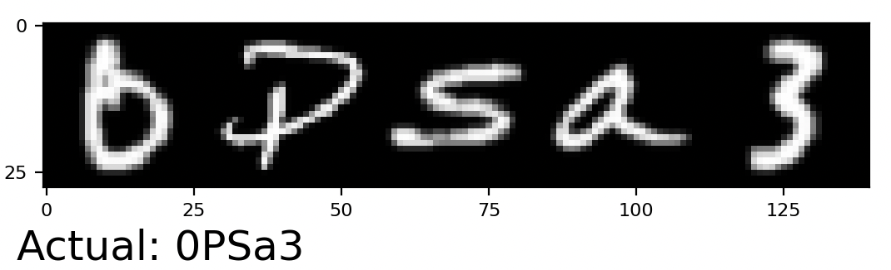
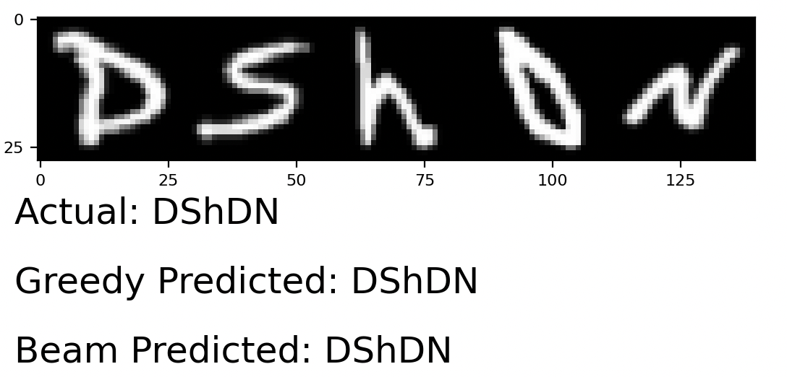

### Пример OCR с использованием CTC Loss

## Overview

Задача представляет собой распознавание символов из датасета EMNIST.

Цель: добавить в пайплайн предсказания алгоритм `beam search` и сравнить результаты.

## Description

По сравнению с исходным вариантом в качестве обучающего набора данных был использован EMNIST с модификацией `balanced` (цифры и английские буквы).

В качестве `beam search` была использована реализация `ctc_decoder` из `torchaudio.models.decoder` ([ссылка на док](https://pytorch.org/audio/main/generated/torchaudio.models.decoder.ctc_decoder.html#torchaudio.models.decoder.ctc_decoder)).

Для обучения использовались последовательности от 3 до 5 символов.

Пример последовательности:



Для обучения использовалась выборка из 1000000 последовательностей. Обучение проходило на 5 эпохах. 

```
Метрика Accuracy на обучении: 0.815371
Метрика Accuracy на валидации: 0.79
```

Для тестирования обученной модели использовалась выборка из 1000 последовательностей.

Тестирование проходило на выборке из 1000 последовательностей с помощью двух подходов: greedy search и beam search. Также замерялась метрика `CER` - Character Error Rate.

```
Average Greedy CER: 0.105
Average Beam CER: 0.1205
```

Пример генерации




##

Запуск проекта:
1. Выполнить сборку образа
```
docker build -t ocr .
```
2. Внутри контейнера запустить обучение
```
python train.py
```

### Исходный проект:
* https://github.com/dredwardhyde/crnn-ctc-loss-pytorch